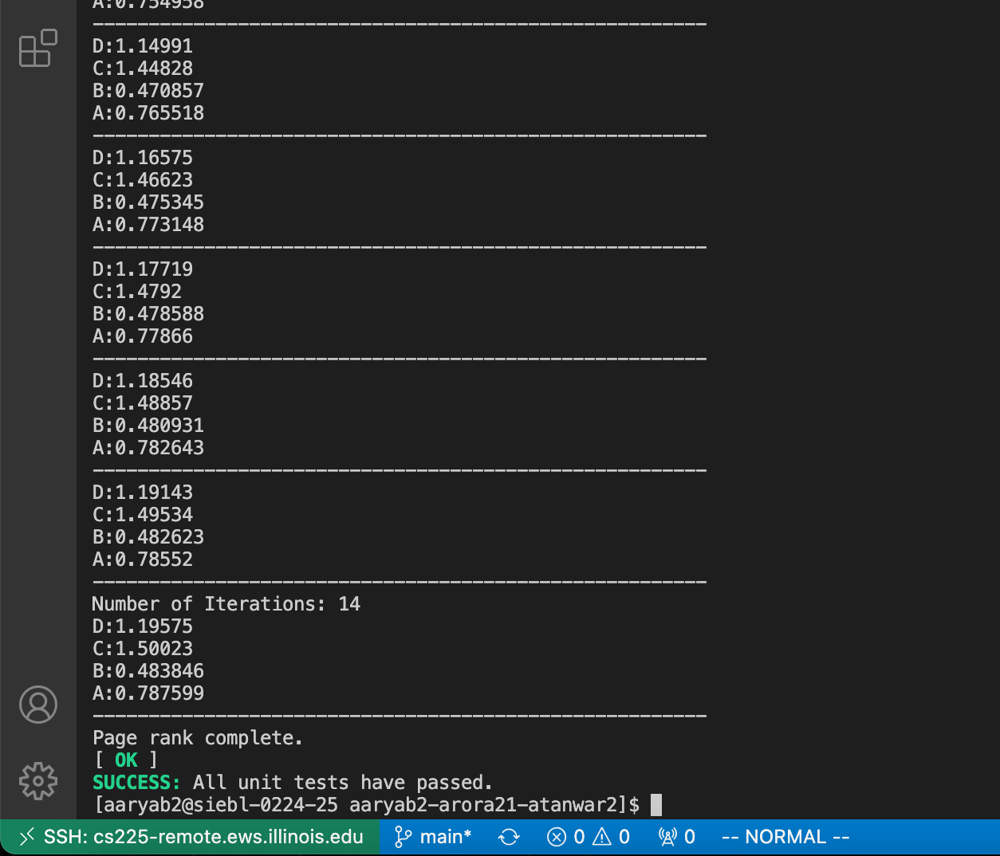

# Dataset and Algorithm Footnotes

## Objectives

* Find an optimal flight route between any two airports based on two different metrics, which are as follows:
    * The optimal path based on the least number of connecting flights - found using a modified BFS traversal. 
    * The optimal path based on shortest distance - found using the Dijkstra's algorithm.
* Find the strongly connected components and build a condensed graph by shrinking each strongly connected component into a single component. 
* Find the most important airports using the Page Rank algorithm. The Page Rank provides a probability distribution of the likelihood of a person to visit each airport.

## Data Processing

### Vertices

* The airports are read from the file res/OpenFlights/airports.dat.csv. While creating the vertices with the airports, we check if the airport has been previously created. If so, then we check which code is used - IATA or ICAO. We give preference to the IATA code. However, if neither IATA nor ICAO is present (if they are equal to \N) then the vertex isn't created. The vertices are identified by keys that are equal to the airport code. 
* The vertices are inserted into a hashmap 'vertices' in the Graph class.
* All vertices contain a boolean (baes on whether the vertex is visited), a parent pointer, distance, and rank. These attributes are used by the algorithms.
* The vertices of the graph store adjacency lists containing the keys to the other vertices that can be visited.

### Edges 

* The routes are read from the file res/OpenFlights/routes.dat.csv. Edges are created with the source and destination keys. The source and destination keys correspond to the vertex that contains the airport with that key. If the keys don't exist, we create the vertex.
* All the routes in the data only contain IATA codes, which implies that the airports with only ICAO codes do not contain any edges in the graph.
* All Edges are of type Edge&lt;std::string&gt; for our graph. The edges only need a single parameter for the template because they only store the keys and the values can be accessed by the vertices with those keys.
* Although the vertices contain pointers to the Edges that contain it as the source, the edges are also maintained in a vector by the Graph class.

### Distances

* Once the edges have been initialized, it is a matter of iterating over all the edges using the list of edge pointers stored by our graph class. 
* For each edge we can access the endpoints and the vertices via the keys to access the airports and their coordinates.
* Once we have the coordinates we use the **Haversine** distance formula (implemented in our util namespace) to set the distance of the edge.

### IO

* The functions defined in the util namespace (in util.h) are used to parse the csv file. The csv file is broken down into lines, where every line is parsed into tokens for validation. 
* The parse_csv_file function handles all the IO-handling and returns to us a 2d list of string tokens of type std::vector&lt;std::vector&lt;std::string&gt; &gt;. * A filename is accepted as a parameter and the parse csv file and its helper function (parse line) are tested properly in the test case defined by test_parse.

## Algorithms Overview

We implement the following algorithms on our graph: Breadth-first search, Dijkstra's Algorithm, Kosaraju's Strongly connected components algorithm, and Page Rank. The algorithms are described in more detail below.

## Breadth-First Search

The BFS is implemented by a function BFS in the Graph class. The function directly manipulates the data members of the Vertices during execution. The parent of the vertices visited in the path is updated to point to the vertex before the current vertex in the path. Our path function in the graph class can trace the path up to the source with this information.

## Dijkstra's Algorithm

The complexity of Dijkstra is brought down by using a min-heap. In particular, we use a priority queue of std::pairs where the first value is the float distance of the vertex from the source and the second value is the pointer to the vertex with that distance. We use the standard greater-than comparator, std::greater for comparison in the priority queue.

## Kosaraju's Algorithm

## Details

For this algorithm, we used two DFS traversals of the graph slightly modified. The first time we discover the order in which the vertices are visited in the DFS. The second time we run the DFS in the order of last to first visited vertex but on the Transposed Graph. The Transposed graph is the original graph with the direction of every edge flipped around.

## Graph Condensation Algorithm

We use an implicit disjoint set as each vertex has its parent pointer store the representative vertex of that strongly connected component. We select the first vertex of each SCC as the representative and make all the vertices of that component point to it. The root points to null.

## Page Rank

Page Rank algorithm is used to rank the vertices by their importance. The vertices store a rank variable that contains their final rank value. 

We use the formula for Page Rank given below:

* PageRank, PR(u) = 1 - d + d * (SUM of (PR(v)/Degree(v)) for all v that have an edge to u), where d is a damping factor = 0.85.

* Initially, the page ranks are determined by the formula: PR(u) = 1/(N), where N = number of vertices in the graph.

* We do successive iterations of page rank until PR(v(t+1))-PR(v(t)) &lt; Error for all vertices v. Our error bound is 0.005. Only when the difference in ranks between successive iterations is less than the error bound for all vertices, we terminate the algorithm. We have set a max iteration bound to 1000, although it never really gets that large.

* The ranks get better over multiple iterations. That is the thought behind this algorithm.

* If the degree of a vertex is 0, we change it to N. This means there is an equal probability of visiting any vertex from that vertex. This ensures there is no division by zeroes and a fair probability for all the vertices.

We print the 50 most popular airports in the world using page rank on the graph.

