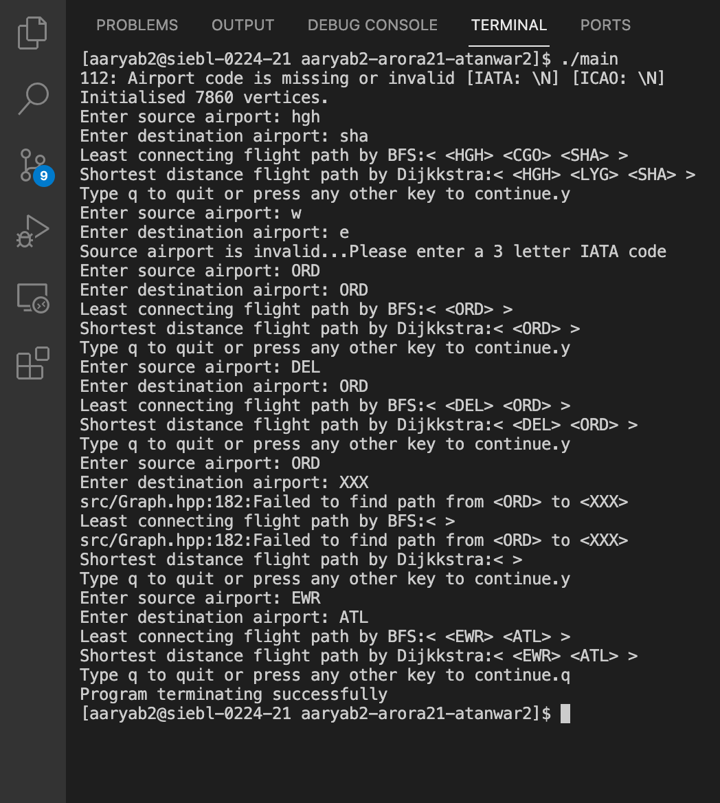

# CS 225 Data Structures

### OpenFlights Project

For our project we have decided to use the [OpenFlights](https://openflights.org/data.html) dataset and we plan to do the following:

* Find the optimal flight path between two airports.
  * The optimal path with the least connecting flights. We solve this with a modified BFS traversal. 
  * The optimal path with shortest distance using the Dijkstra's algorithm.

* We build a condensed graph by discovering the strongly connected components of the graph and commpressing them into a single component.

* Find the most important airports, using the Page Rank algorithm. The Page Rank outputs a probability distrbution of how likely a person is to visit each airport.

# Final Project Video

[Link to Video Recording](https://illinois.zoom.us/rec/play/iWi8_Td3fKdPzKow5FZ6gJ42QmUBacuPbVJUE02qITtCrMyP_SdlPyX85nZckwK0u_sxCVqFDPVetWof.wWaQnvNuAOQXfyf9?startTime=1639341204000&_x_zm_rtaid=VCo3Nh4HQPSl4z_JVTQgAw.1639344664850.60bb9a48d773485d671ff9cea89e72c9&_x_zm_rhtaid=974)

[Link to Presentation Slides](https://github-dev.cs.illinois.edu/cs225-fa21/aaryab2-arora21-atanwar2/blob/main/CS%20225%20-%20Final%20Presentation.pdf)

# How to Build

You should download our code using the following command:

```
git clone https://github-dev.cs.illinois.edu/cs225-fa21/aaryab2-arora21-atanwar2
```

From inside the project directory compile the code with the Makefile.

```
cd aaryab2-arora21-atanwar2
make
```

The makefile will create an executable with the name 'main'. Now you can run the program.

```
./main
```

The command line interface will ask you to enter the following details: The source airport and the destination airport. You must enter the 3 letter IATA or (if not available) the 4 letter ICAO code of the airports only. The program will not find a path for invalid input. After typing in the input parameters the program will find the shortest paths and output it to the console. Below is a screenshot of the program for an example input.  



# Testing

To compile and run the test cases do the following:

```
make test
./test
```
The test cases are as follows:
* test_parse
* test_small_graph
* test_scc_airports
* test_scc
* test_big_graph
* test_page_rank
* test_page_rank_big

To run a selected test case use the following command:

```
./test NAME
```

For example, ./test test_parse will run the test cases described by test_parse.

The test cases are described in more detail here: [RESULTS](RESULTS.MD)


## Input/Output Formats

To create a graph you must include a Key and Value type while instantiating for example:
```
Graph<std::string, Airport> g1;
Graph<char, int> g2;
```

The first graph g1 will have a string as key and Airport as value.
The second graph g2 will have a char as key and int as value.

The vertices associated with this graph will also have a similar type:

```
Vertex<std::string, Airport> v1; // For g1
Vertex<char, int> v2; // For g2
```

The edges associated with this graph only need a key.

```
Edge<std::string> e1; // For g1
Edge<char, int> e2; // For g2
```

* To build the graph from the airport dataset we provide a **GraphBuilder** class, which handles all the processing for you. It also accepts parameters for the routes filepath and airport filepath but includes the default path to our dataset.

```
Graph<std::string, Airport> *graph = GraphBuilder::build();
``` 

* To run the bfs algorithm on our graph you can call the bfs member function on the graph object. For example, g1.bfs(src,dest). You should specify a valid src,dest key for the start and end vertex respectively. The bfs will manipulate the data inside the vertices of the graph so we can find out the path using the path function: g1.path(src, dest). This will return a vector of Key types which correspond to the vertices of the path.
* Dijkstra is similar. You can use dijkstra by running the following code:

```
std::string src = "ORD";
std::string dest = "DEL";
g1.dijkstra(src, dest);
std::vector<std::string> path = g1.path(src, dest);
```

* For Strongly connected components, we have created a separate class since it has a few member functions. You must initialize an SCC instance with a pointer to the graph in question. Then call the scc function to start the search. scc will interally use dfs twice to solve this problem. In the same class we have a function to build the condensed graph. Consider the following code, for example:

```
SCC scc(&g1);
scc.scc();
std::vector<std::vector<std::string> > &components = scc.get_components();

//Do something with the components

Graph<std::string, Airport> *condensedGraph = scc.build_condensed_graph(); // The condensed graph has the same type.

// Do something with the condensedGraph

delete condensedGraph; // Free up memory.
```

* For Page Rank, use the PageRank class to create an instance of PageRank and initialise it using a graph pointer. The solve function will compute the page ranks for all vertices and update their values in the graph. The solve function will continue to run till the page ranks reach a steady state defined by our error bound = 0.005. It also contains two useful functions - to print and display the ranks for each vertex & to get (rank,key) pairs in order of ranks from greatest to smallest. Here is how you can run the algorithm on our graph:

```
PageRank p(&g1);
p.solve();
p.print();
std::vector<std::pair<float, std::string> > ranks = p.get_ranks();
// The most important airport is the one with key equal to ranks[0].second and it has a rank of ranks[0].first.
```

## Time Complexity

* Kosarajus algorithm for finding strongly connected components: O(V+E)
* Graph Condensation using strongly connected components: O(V+E)
* Dijkstras Single source shortest path algorithm: O(V+ElogV)
* DFS/BFS Traversal and Pathfinding: O(V+E)
* PageRank: O(kVE) // k is number of iterations

# Location of Code, Data and Results

* log/ - The log directory contains console output logs. 
  * log/condensed_graph.txt contains the output for the condensed graph in the following format: Each line contains an airport followed by the list of airports in its adjacency list.
  * log/scc.txt contains the output for the strongly connected components. All lines have a list of airports which are part of a particular strongly connected component.
* res/ - The res directory contains resources such as the datasets as .csv files, images and input files for test cases. 
* lib/ - The lib directory contains the external acutest.hpp header file which is used for the testing framework. 
* src/ - The src directory contains all of our source code and test cases. There are several classes used in our project:
  * Airport: This stores the data about the airport such as its name, city, country, and coordinates.
  * util: The functions in this file are enclosed in the util namespace and are helper functions. They do tasks such as parsing the csv files, converting a vector to string, calculating the distance between two coordinates.
   * For parsing the csv file we process each line separatelt. We ignore the commas within quotes and remove the trailing spaces. 
  * GraphBuilder: This class builds the airport graph for our purpose. It reads the vertices and edges from the airports and routes file in the dataset. It initialises the graph with the data. 
  * Vertex: This represents a vertex in the graph.
   * The vertex is templated like the graph.
   * It contains a key, value pair. It also stores the parent pointer, distance, visited, rank and other data required for the algorithms. However, the key, value is not essential to the working of the algorithms.
  * Graph: This represents the model of our graph. 
   * It contains a map of keys to vertices and a list of edges. 
   * Each vertex also has an adjacency list with pointers to the edges that contain the vertex key. 
   * The graph as well as most of our code is templatised. 
   * The parameters for the template are the type of Key and Value we want to store for our vertices. 
   * Each vertex is identified by the key, and additional data is stored as value. 
   * In our case, the graph builder creates a graph with key string and value Airport.
   * For some of the test cases, we also create a graph with single characters. 
   * Airport with invalid keys are not created.
   * The graph has the BFS and dijkstra algorithm as member functions. The update the data in the vertices such as the parent pointer and distance value. Then our path function traces back the path from the destination vertex by following the parent pointers, and finally reverses it.
  * Edge: Each Edge has a single template parameter of a key. The edge stores the keys for the start and end points. It stores the distance between the vertices i.e the cost associated with the edge.
  * PageRank: This file contains the page rank algiorithm. The function accepts the graph as a parameter. The solve function runs the algorithm on the graph till the page ranks reach a steady state.
  * SCC: This file contains the strongly connected components, DFS and graph condensation algorithm. It also accepts the graph as a parameter in the constructor and operates on it.
  * K: This namespace stores all the constants such as file names for the location of the datasets.
  * test.cpp: This file contains all the test cases. We have used the 'acutest' framework for testing.
* The root directory contains the following files:
  * Markdown files
   * Goals - Describes leading question, objectives, dataset overview and processing, algorithms overview, final deliverables and timeline
   * Dataset and Algorithms footnotes - Addtional information about data processing and algorithms (like formulas, example outputs etc.)
   * Results - Final deliverables of your project, including proof that our algorithms are working as intended.
   * Development - Weekly log of task completion
   * Contract - Formalizes your team’s views on both core logistical issues as well as common pitfalls you may encounter over the course of your project
  * Makefile
  * Executables - main, test

# Team Members
* Aarya Bhatia: @aaryab2
* Ananyaa Tanwar: @atanwar2
* Samiksha Arora: @arora21
