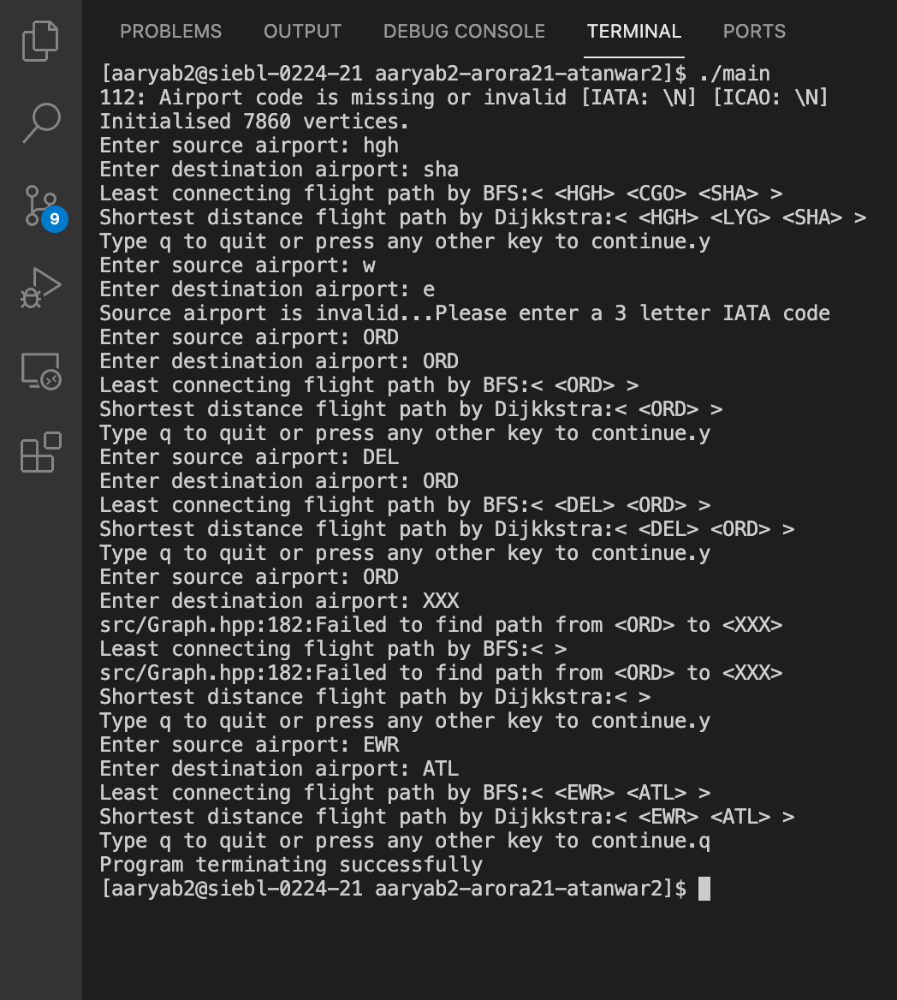

# Results

## Team Mates: aaryab2, arora21, atanwar2

## Mentor: Xin Jin

# Final Deliverables

Using the OpenFlights dataset, we:

* Found the optimal flight path between two airports based on least connecting flights (BFS) and shortest distance (Dijkstra's algorithm).
* Discovered the strongly connected components and built a condensed graph by shrinking each strongly connected component into a single component.
* Found the most important airports, using the Page Rank algorithm. 

Our graph is simple, directed and weighted.

# Main

We ran the main program to test BFS and Dijkstra on the command line. A screenshot of the output is shown below:

We test the program for the following things:

* When passed keys in lower case, it should convert it to upper case. The first input shows hgh and sha (airports) in lower case but the path returned has the airport keys in all caps.
* When passed in an invalid key, it should stop. For example, when we passed in w and e as arguments, it did not find path but asked us to re-enter the input.
* When passed in the same source and destination, the path should consist of only one airport. For example, ORD to ORD is just ORD.
* When passed in reasonable and valid input, there should be a valid and sensible path as output. For example, DEL to ORD is a direct flight which is indeed the shortest path from Delhi to Chicago.
* When passed in an airport which does not exist in the graph, it returns an empty path and informs the user why it did so. We can see this in the example where we entered ORD and XXX. XXX is no airport.
* Lastly, we presented another valid example, to check if path works on various inputs.

Hence, BFS and Dijkstra do the right thing with any given input in our program.

# Tests

We describe and show the output for all the test cases below.

## Strongly Connected Components

### test_parse

The purpose of this test is to check the util::parse_line and util::parse_csv_file function.

We provide it with sample input as string the first time and we make it parse a simple csv file the second time. The tokens contain quotes and comma separated values as would be found in the dataset. The csv file contains two columns on each row- an ID and a name. We ensure that our function returns the correct tokens for different inputs as a vector. We also ensure there are the same columns on every row of the csv file, so there will not be missing data.

We also print the 2d vector of tokens using the util::to_string function that wraps each token in angular brackets and also the entire vector in angular brackets for clarity.

### test_scc_airports and test_scc

There are two tests. The test_scc function creates a simple graph with char keys from A to F. We check that the strongly connected components in our made up graph are working as expected. We also ran the condensation graph algorithm and observed the output. There were only two components and one pointed to the other. This is what we can see from the screenshot below. Later, we tested our algorithm on the whole airport graph. Since the output was long, we write it to a file using a Logger class. The 2nd and 3rd screenshots show some of the output in the log file. 

The format of the scc log file is such that each line contains the list of vertices that are in the same strongly connected component.

The format of the condensed_graph log file is such that each line starts with the root vertex of the strongly connected component and has the list of adjacent vertices after it.

### test_scc output

### SCC Log

This test helps us understand about the connectivity of our graph. As shown below we found out that there were 9 strongly connected components with multiple vertices while the other 4470 were singular airports. The biggest cluster of interconnected airports has 3354 airports in it. This shows that there are many possibilities of travel within that cluster of places even with some of the airports not being able to function.

### Condensed Graph Log

### test_small_graph

We construct a small graph for this test manually inserting the vertices and edges into the graph. The graph type is &lt;char,int&gt; so all the keys are letters from A to F. A hand drawn picture of the graph is shown below.

We use this graph to test BFS and Dijkstra. We confirm that end state of the graph is correct. Since, we know the order of vertices in the adjacency list, we can predict the output and check for that in the graph. An output of the tests is shown below.

In this case, both BFS and Dijkstra return the same shortest path: A->B->D->F.

### test_big_graph

BFS and Dijkstra is run on our large airport graph. We do not check the end state as thoroughly as before but confirm certain things about the path such as checking if the source and destination are the correct keys and there exists an edge between successive vertices of the path. An output is shown below:

### test_page_rank

Our page rank implementation directly uses the defintion of page rank. We sum up the value of page rank/degree for every vertex which has an edge to the current vertex. For this reason, we need a adjacency list for inbound edges. These are initialised at the start of the algorithm, and stored directly in the vertices. The other thing to handle carefully is the case when a vertex has no outbound edges. In that case it's degree would be considered as N. Then, it would contribute 1/N times the current page rank, which would be smaller than other vertices as their degree << N.

We run page rank on a small graph and observe the changes in ranks between successive iterations. The ranks finally converge to a steady state in 15 iterations. Below is the output of the graph. The graph is created with 4 vertices only.

Output of ranks of a small graph for each iteration:

### test_page_rank_big

We run page rank on our graph. In 26 iterations, the page rank gives us the result. 

We create a vector of (rank,key) pairs and use the std::sort function, with a comparator to sort them in descending order. Then we print the top 50 airports as std output and write all of them to this log [file](log/page_rank_output.txt). Below are the screenshots of the same. Each line prints the airport code, name, city and rank.

Output of top 50 airports run on the Airport graph: 

From the data above, we can tell that the ORD airport in Chicago, Illinois is the second most important airport in the world!

# Overall

* Dijkstra gives us a realistic view of how Airplanes find the optimum routes between airports. Real world applications would have more factors at play such as heuristics like traffic, weather and cost. Thus, we would modify Dijkstra into a more involved algorithm like A*. Our simple traversal method used a BFS where there were no factors to consider. We modified BFS into Dijkstra by considering the distances. Thus, we observed the similarities and differences between various pathfinding algorithms in our project. We saw how details like edge weight and queue/heap data structures affected the overall path.

* Page Rank gives us an idea of how interconnected each airport is. The airport which has more incoming flights is more important than an airport with few or none.

* One use of the strongly connected components and condensed graph is as follows. We can plan a trip from a country A to country B such that we visit the maximum cities in our way. This can be achieved by visiting all the airports in a SCC before taking a trip to another SCC. Since the condensed graph does not contain any cycles we can observe more clearly how one vertex is related to another. Moreover, we can quickly tell if two airports are reachable by checking if they lie in the same SCC.

We are happy with our results and all that we learned from this project. In the future we would like to improve or implement the following things to our project:

* Visualisation
  * Visualising the shortest path on a map
  * Visualising the page rank algorithm with bubbles of varying size
* Involve applications of condensed graph
* We would like to make our project more visual and user friendly in the future. 
* A more flexible command line interface would be fun for the users.
* We would observe if page rank and SCC have similarities because the airports which have more connections should be more reachable, thereby increasing their rank.

